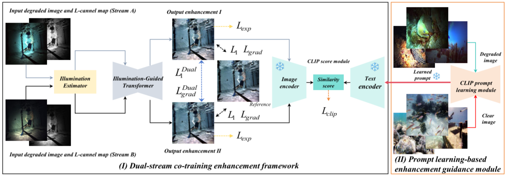

  
# Enhance Underwater Imaging in Nonuniform Artificial Light: An Extended Benchmark Dataset and A Dual-Stream Co-training Enhancement Model

   
   

## Setup

You can refer to the configuration https://github.com/caiyuanhao1998/Retinexformer

## Testing steps
You can select the underwater images to be tested from the UIEB dataset from: <a href= "https://li-chongyi.github.io/proj_benchmark.html" target='_blank'>[UIEB]</a>, and use our pre-trained models from: <a href="https://pan.baidu.com/s/11BH-JusDxpHPb7EIuGgDYQ?from=init&pwd=2p0n" target='_blank'>[model]</a>, and run the following commands:

    python test.py
The rusults are saved in ./results/

## When the paper is accepted, we release the relevant code.
