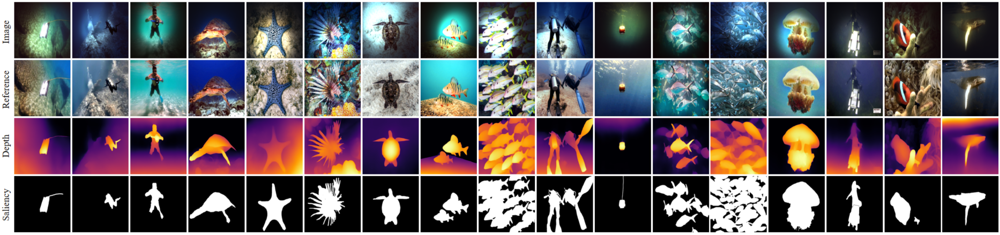

# Enhance Underwater Imaging in Nonuniform Artificial Light: An Extended Benchmark Dataset and A Dual-Stream Co-training Enhancement Model
Zhou Ge, Han Mei, Kunqian Li*, Dalei Song

   

The dataset SUIM-AL and source code and pre-trained model of the enhanced model DSFormer are about to be released.

