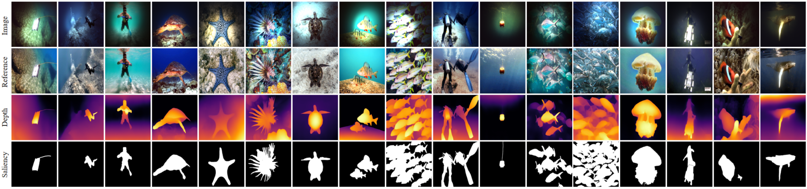
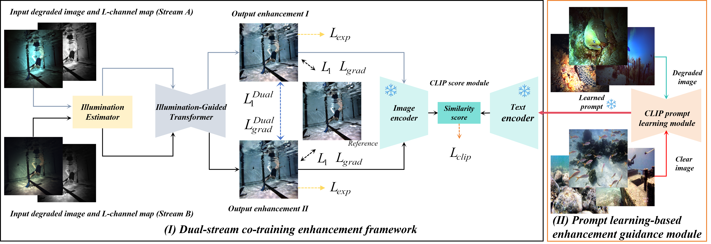

<h1>Enhance Underwater Imaging in Nonuniform Artificial Light: An Extended Benchmark Dataset and A Dual-Stream Co-training Enhancement Model

<h4 align="center">
    <a href="https://github.com/OUCVisionGroup/SUIM-AL" target='_blank'>[Project Page]</a> •
    <a href="https://ieeexplore.ieee.org/abstract/document/11429073" target='_blank'>[Paper]</a>
</h4>

---

## Dataset preparation 
Based on the physical imaging model, we introduce an AL incorporated underwater imaging synthesis pipeline and SUIM-AL — a large-scale underwater image benchmark with 16350 samples across ten water types and diverse lighting conditions, including artificial light.

   

The complete dataset as well as the training and testing sets used for the model have all been uploaded.[SUIM-AL dataset](https://drive.google.com/drive/folders/1gSgA6nIlQXwdKlGYCW0ix0dD3kT7heTZ?usp=drive_link)

## Enhancement Model 
We propose DSFormer, a dual-stream Transformer network with shared weights, trained on pairs of images under varying lighting and degradation conditions to improve robustness.

   

## 💻Setup
- PyTorch >= 1.11
- CUDA >= 11.3  
- For other dependencies and environment configurations, please refer to **[Retinexformer][(https://github.com/caiyuanhao1998/Retinexformer)]**

   

## Dataset preparation 

The dataset SUIM-AL and source code and pre-trained model of the enhanced model DSFormer are about to be released.

